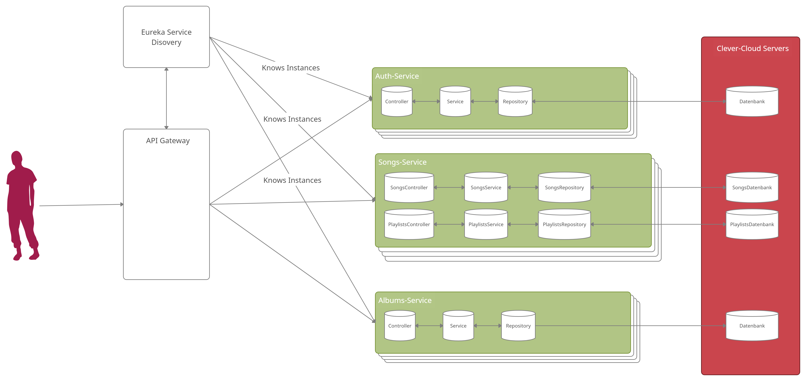
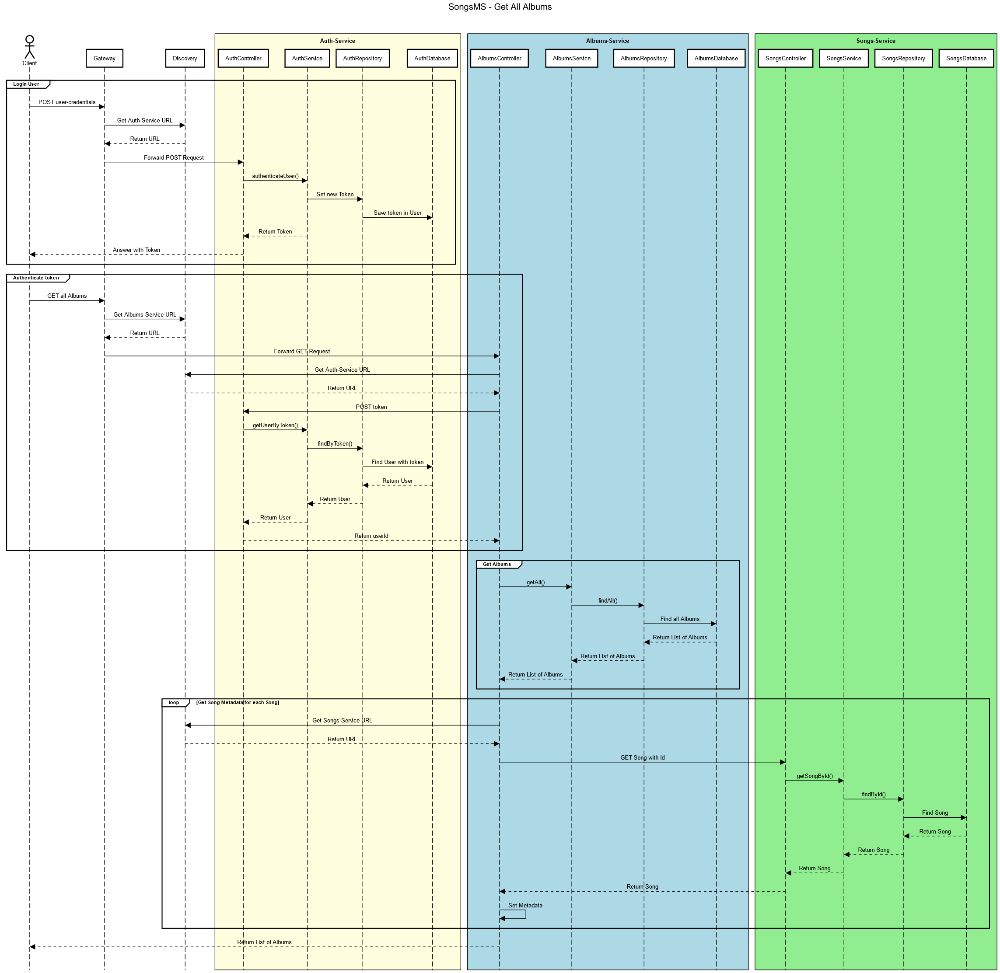

# SongsMS - Julian Knepel

## Installation

Die Services können mittels ```mvn spring-boot:run``` in dieser Reihenfolge:
> Registry > Auth-Service > Songs-Service > Albums-Service > Gateway

gestartet werden.

## Projekt Struktur
Die Datenbanken liegen auf dem [Clever-Cloud](https://console.clever-cloud.com/) Server. Die Auth- und Songs-Services benutzen jeweils eine PostgreSQL Datenbank und Albums-Service benutzt MongoDB.


Sequenzdiagramm für das Einloggen eines Users und eine GET Anfrage an /albums.

